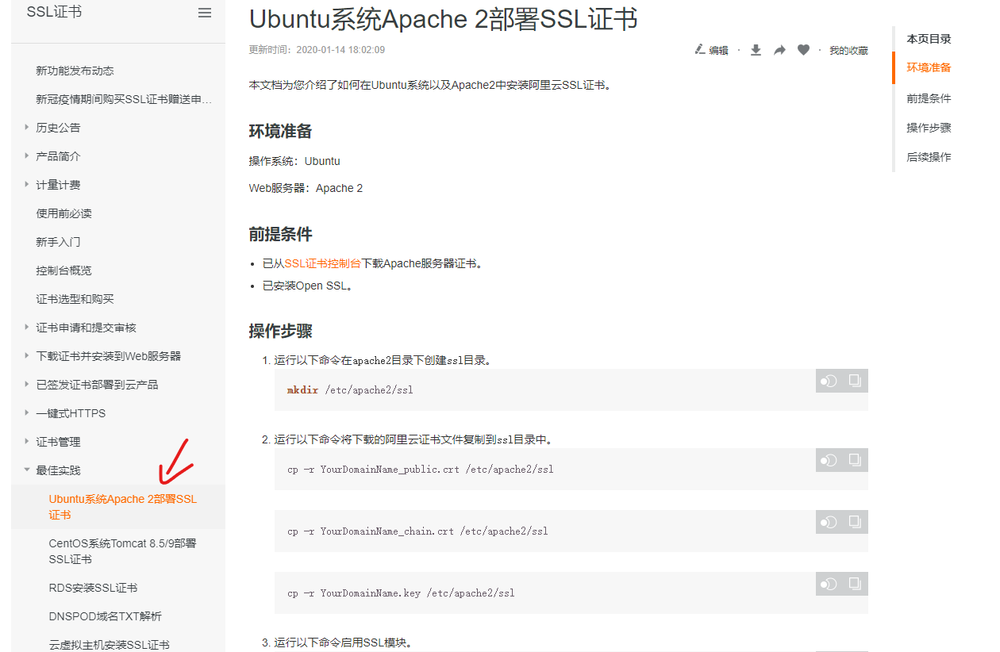

## 网站设置https

### 购买免费ssl证书

1. 进入ssl产品页


2. 点击选购证书


3. 选择证书类型为 免费版（个人）DV


4. 点击立即购买


5. 去支付


6. 之后进入证书控制台


7. 这是会弹出申请证书提示


8. 填写申请内容


9. 验证dns


10. 点击提交审核


11. 然后等待证书签发，大概5分钟左右，签发后点击下载


12. 选择服务器类型，我用的是Apache，下载对应证书


13. 不同服务器可以参考阿里云部署文档

[阿里云帮助文档](https://help.aliyun.com)

接下来可以参考阿里云的Ubuntu Apache2的ssl部署文档


### 上传证书至服务器

14. 连接服务器，上传ssl证书，这里使用的是MobaXterm
在 /etc/apache2/ 目录下创建ssl目录
  
```
cd /etc/apache2/
mkdir ssl
```

将证书直接通过ftp传入/etc/apache2/ssl目录下，使用MobaXterm直接拖动即可


### 配置ssl

15. 开启ssl
```
sudo a2enmod ssl
// root用户不需要输入sudo
```


16. 修改ssl配置文件
```
vi /etc/apache2/sites-available/default-ssl.conf
```
修改内容有
1. ServerName
2. SSLCertificateFile
3. SSLCertificateKeyFile
4. SSLCertificateChainFile
```
<IfModules mod_ssl.c>
<VirtualHost *:443>  
ServerName   #www.YourDomainName.com
SSLCertificateFile /etc/apache2/ssl/www.YourDomainName_public.crt   #将/etc/apache2/ssl/www.YourDomainName.com_public.crt替换为证书文件路径+证书文件名。
SSLCertificateKeyFile /etc/ssl/apache2/www.YourDomainName.com.key   #将/etc/apache2/ssl/www.YourDomainName.com.key替换为证书密钥文件路径+证书密钥文件名。
SSLCertificateChainFile /etc/apache2/ssl/www.YourDomainName.com_chain.crt  #将/etc/apache2/ssl/www.YourDomainName.com_chain.crt替换为证书链文件路径+证书链文件名。
						
```


17. 运行以下命令把default-ssl.conf映射至/etc/apache2/sites-enabled文件夹中建立软链接、实现二者之间的自动关联

```
sudo ln -s /etc/apache2/sites-available/default-ssl.conf /etc/apache2/sites-enabled/001-ssl.conf
```


18. 重新加载Apache2配置文件,重启服务器

```
sudo /etc/init.d/apache2 force-reload
sudo /etc/init.d/apache2 restart
```


19. 阿里云注意要配置网络安全组，放行443端口


### 设置http自动跳转https

20. 设置http重定向https

```
sudo a2enmod rewrite 
vim /etc/apache2/sites-available/000-default.conf
```
在 <\VirtualHost *:80><\VirtualHost> 标签内随便一个地方加入以下三行
```
RewriteEngine on
RewriteCond   %{HTTPS} !=on
RewriteRule   ^(.*)  https://%{SERVER_NAME}$1 [L,R]
```
重启Apache2
```
sudo service apache2 restart
```


#### 到这里就设置完毕了